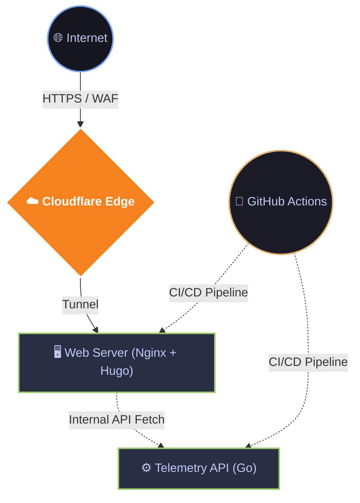

# 🚀 SRE Portfolio (App Repository)

A minimalist, high-performance portfolio built with a **Docs-as-Code** philosophy. This repository contains the application layer (Microservices) of my personal infrastructure, designed to showcase my skills in **Go**, **Static Site Generation**, and **Optimized Containerization**.

## 🛠 Tech Stack

### Frontend (Web Service)
* **Engine:** Hugo (Static Site Generator)
* **Theme:** PaperMod (Customized "Invictus" SRE Theme)
* **Web Server:** Nginx (Alpine-based, ultra-lightweight)

### Backend (API Service)
* **Language:** Golang 1.22
* **Architecture:** REST API exposing live server telemetry
* **Container:** Distroless/Alpine (Multi-stage build for zero-vulnerability footprint)

### Delivery & CI/CD
* **Source Control:** Git / GitHub
* **Pipelines:** GitHub Actions (Automated Linting, Build, and Multi-architecture Image Push)
* **Orchestration:** Docker Compose

## 🏗 Microservices Topology


```mermaid
graph TD
    classDef user fill:#16161e,stroke:#7aa2f7,stroke-width:2px,color:#c0caf5
    classDef cf fill:#f6821f,stroke:#fff,stroke-width:2px,color:#fff,font-weight:bold
    classDef app fill:#292e42,stroke:#9ece6a,stroke-width:2px,color:#c0caf5
    classDef cicd fill:#1a1b26,stroke:#e0af68,stroke-width:2px,color:#c0caf5

    User((🌐 Internet)):::user -->|HTTPS / WAF| CF{☁️ Cloudflare Edge}:::cf
    CF -->|Tunnel| Frontend["🖥️ Web Server (Nginx + Hugo)"]:::app
    Frontend -.->|Internal API Fetch| Backend["⚙️ Telemetry API (Go)"]:::app
    
    GitHub((🐙 GitHub Actions)):::cicd -.->|CI/CD Pipeline| Frontend
    GitHub -.->|CI/CD Pipeline| Backend
```

## ⚡ Quick Start (Local Development)

1.  **Clone the repository:**
    ```bash
    git clone [https://github.com/ezequieldlv/portfolio-sre](https://github.com/ezequieldlv/portfolio-sre)
    cd portfolio-sre
    ```

2.  **Run with Docker Compose (Full Stack):**
    ```bash
    docker compose up -d
    ```
    *Access Frontend at `http://localhost:8095`* *Access Backend at `http://localhost:8585`*

## 🗺 Application Roadmap
- [x] Base Design & Markdown Content (Hugo)
- [x] Backend Telemetry API Development (Golang)
- [x] Optimized Dockerfiles (Multi-Stage & Distroless)
- [x] Local Orchestration (docker-compose.yml)
- [x] CI/CD Pipeline Implementation (GitHub Actions)

---
*Developed by Ezequiel | Running on the `ez-lab` edge node.*
