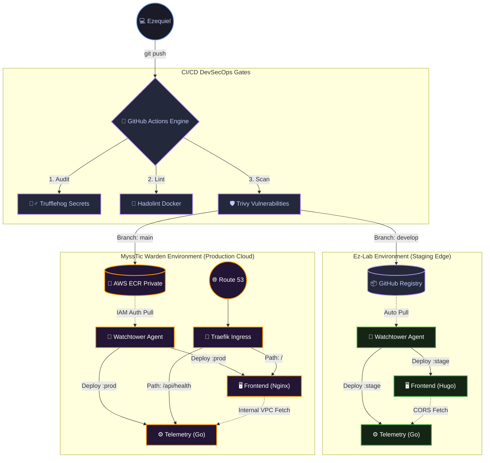

# 🚀 SRE Portfolio (App Repository)

A minimalist, high-performance portfolio built with a Docs-as-Code philosophy. This repository contains the application layer (Microservices) of my personal infrastructure, designed to showcase my skills in Go, Static Site Generation, and Optimized Containerization.

The production environment has been migrated from a legacy edge setup to a hardened cloud-native architecture on AWS, incorporating DevSecOps pipelines and GitOps deployment strategies.

## 🛠 Tech Stack

### Frontend (Web Service)
* Engine: Hugo (Static Site Generator)
* Theme: PaperMod (Customized "Invictus" SRE Theme)
* Web Server: Nginx (Version-pinned Alpine-slim, strict security headers)

### Backend (API Service)
* Language: Golang 1.22
* Architecture: REST API exposing live server telemetry
* Container: Distroless (Multi-stage build for a zero-vulnerability footprint)

### Delivery & DevSecOps
* Source Control: Git / GitHub Flow
* Security Scanning: Trufflehog (Secrets), Hadolint (Dockerfiles), Trivy (Container Vulnerabilities)
* CI/CD Pipelines: GitHub Actions (Multi-environment logic: Staging -> GHCR, Production -> AWS ECR)
* Deployment Automation: Watchtower (Autonomous GitOps pull agent for Zero-Downtime updates)

## 🏗 Microservices Topology

```mermaid

    graph TD
    classDef dev fill:#1a1b26,stroke:#7aa2f7,stroke-width:2px,color:#c0caf5
    classDef cicd fill:#24283b,stroke:#bb9af7,stroke-width:2px,color:#c0caf5
    classDef edge fill:#152515,stroke:#44aa44,stroke-width:2px,color:#fff
    classDef cloud fill:#221535,stroke:#ff9900,stroke-width:2px,color:#fff
    classDef net fill:#1f2335,stroke:#7aa2f7,stroke-width:1px,color:#a9b1d6

    %% FLUJO DE CÓDIGO
    Developer((💻 Ezequiel)):::dev -->|git push| GitHub{🐙 GitHub Actions Engine}:::cicd

    subgraph "CI/CD DevSecOps Gates"
        GitHub -->|1. Audit| Trufflehog[🕵️‍♂️ Trufflehog Secrets]:::cicd
        GitHub -->|2. Lint| Hadolint[🐳 Hadolint Docker]:::cicd
        GitHub -->|3. Scan| Trivy[🛡️ Trivy Vulnerabilities]:::cicd
    end

    %% ENRUTAMIENTO POR RAMAS (LOGICA DEL PIPELINE)
    Trivy -->|Branch: develop| GHCR[(📦 GitHub Registry)]:::cicd
    Trivy -->|Branch: main| ECR[(🐳 AWS ECR Private)]:::cloud

    %% ENTORNO STAGING (RASPBERRY PI)
    subgraph "Ez-Lab Environment (Staging Edge)"
        GHCR -.->|Auto Pull| WatchtowerPi[🔄 Watchtower Agent]:::edge
        WatchtowerPi -->|Deploy :stage| WebStage["🖥️ Frontend (Hugo)"]:::edge
        WatchtowerPi -->|Deploy :stage| APIStage["⚙️ Telemetry (Go)"]:::edge
        WebStage -.->|CORS Fetch| APIStage
    end

    %% ENTORNO PRODUCCIÓN (AWS)
    subgraph "MyssTic Warden Environment (Production Cloud)"
        ECR -.->|IAM Auth Pull| WatchtowerAWS[🔄 Watchtower Agent]:::cloud
        WatchtowerAWS -->|Deploy :prod| WebProd["🖥️ Frontend (Nginx)"]:::cloud
        WatchtowerAWS -->|Deploy :prod| APIProd["⚙️ Telemetry (Go)"]:::cloud

        Route53((🌐 Route 53)):::cloud --> Traefik[🔀 Traefik Ingress]:::cloud
        Traefik -->|Path: /| WebProd
        Traefik -->|Path: /api/health| APIProd
        WebProd -.->|Internal VPC Fetch| APIProd
    end

```

## ⚡ Quick Start (Local Development)

1. Clone the repository:
   git clone https://github.com/ezequieldlv/portfolio-sre
   cd portfolio-sre

2. Run with Docker Compose (Full Stack):
   docker compose up -d

   *Access Frontend at http://localhost:8095*
   *Access Backend at http://localhost:8585*

## 🗺 Application Roadmap
- [x] Base Design & Markdown Content (Hugo)
- [x] Backend Telemetry API Development (Golang)
- [x] Optimized Dockerfiles (Multi-Stage & Distroless)
- [x] DevSecOps Pipeline (Trivy, Hadolint, Secret Scanning)
- [x] Production Migration to AWS Infrastructure (Route 53 & Traefik)
- [x] GitOps Automation (Watchtower & ECR Integration)

---
*Developed by Ezequiel | Running on the MyssTic Warden cloud backbone.*