# 🚀 SRE Portfolio (Monorepo)

A minimalist, high-performance portfolio built with a **Docs-as-Code** philosophy. Designed to showcase skills in **Site Reliability Engineering**, **Linux Administration**, and **Microservices Architecture**.

## 🛠 Tech Stack

### Frontend (Web)
* **Engine:** Hugo (Static Site Generator)
* **Theme:** PaperMod (Customized "Invictus" SRE Theme)
* **Server:** Nginx (Alpine)

### Backend (API)
* **Language:** Golang 1.22
* **Architecture:** REST API exposing system telemetry
* **Container:** Distroless/Alpine (Multi-stage build)

### Infrastructure
* **Host:** Raspberry Pi 5 (Home Lab Cluster)
* **Orchestration:** Docker Compose
* **Networking:** Cloudflare Tunnel (Zero Trust)
* **CI/CD:** GitHub Actions (Source Control)

## 🏗 Architecture

```mermaid
graph TD
    classDef user fill:#16161e,stroke:#7aa2f7,stroke-width:2px,color:#c0caf5
    classDef cf fill:#f6821f,stroke:#fff,stroke-width:2px,color:#fff,font-weight:bold
    classDef daemon fill:#1a1b26,stroke:#7aa2f7,stroke-width:2px,color:#c0caf5
    classDef app fill:#292e42,stroke:#9ece6a,stroke-width:2px,color:#c0caf5
    classDef hardware fill:#16161e,stroke:#f7768e,stroke-width:2px,color:#c0caf5

    User((🌐 Internet)):::user -->|HTTPS / SSL| Cloudflare{☁️ Cloudflare Edge}:::cf
    Cloudflare -->|Zero Trust Tunnel| Cloudflared[🛡️ Cloudflared Daemon]:::daemon
    
    subgraph "Ez-Lab (Raspberry Pi 5)"
        Cloudflared -->|web-net| Frontend["🖥️ Portfolio (Hugo)"]:::app
        Cloudflared -->|web-net| Backend["⚙️ API Telemetry (Go)"]:::app
        
        Frontend -.->|Internal Fetch| Backend
        
        Auditor["🐍 Python Auditor"]:::hardware -->|Hardware Metrics| OS[("🌡️ Kernel/Sensors")]:::hardware
    end
```



## ⚡ Quick Start (Local)

1.  **Clone the monorepo:**
    ```bash
    git clone [https://github.com/ezequieldlv/portfolio-sre](https://github.com/ezequieldlv/portfolio-sre)
    cd portfolio-sre
    ```

2.  **Run with Docker Compose (Full Stack):**
    ```bash
    docker compose up -d
    ```
    *Access Frontend at `http://localhost:8095`*
    *Access Backend at `http://localhost:8585`*

## 🗺 Roadmap
- [x] Base Design & Content (Hugo)
- [x] Backend API Development (Golang)
- [x] Docker Containerization (Multi-Stage)
- [x] Deploy on Raspberry Pi 5 (Home Lab)
- [x] Network Segmentation & Nginx Reverse Proxy
- [ ] Deep Observability (Prometheus/Grafana)
- [ ] Kubernetes Migration (K3s)

---
*Created by Ez | 2026*